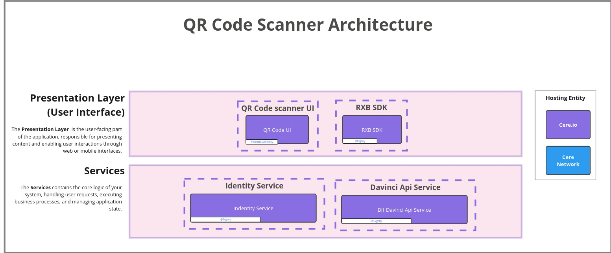
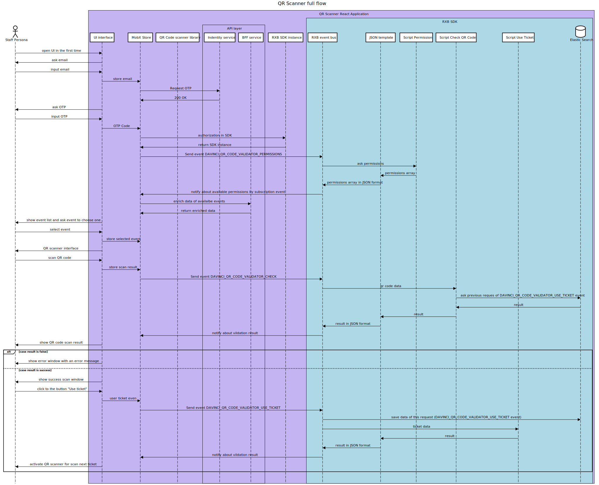

# About

Application for checking tickets at the entrance. Works as part of the Davinci system and is intended exclusively for event staff. Configuration is carried out in RXB and Davici CRM.

### Environments

- dev https://qr-code-scanner-dev.core-dev.aws.cere.io
- stage https://qr-code-scanner-stg.core-stage.aws.cere.io
- prod https://qr-code-scanner.core.aws.cere.io/

## Changelog

[Changelog](./CHANGELOG.md)

## Architecture

The QR code scanner application is a classic react application using the mobx library as a store. The application only works in conjunction with Davinci (the QR codes themselves are generated in Davinci) and uses RXB as a backend. the scripts that are used in RXB can be found in the [rxb/integration-scripts](/rxb/integration-scripts) folder.

### Main flow

see source [here](https://sequencediagram.org/index.html#initialData=C4S2BsFMAIEUCVoGUDGBDAdhyAnaAzAV3HAPAHsB3AKGrRWHLyWDX32gAVcBncjNLQAOaHKBQgRGYAHMc5QkOgBiFABYARmvwBGOIlSZseeJHrBoAQSFDwIdKH7URY+5MwWAqgEloIabj49JDOouLu0tAAsuQaABrIjDghLuFSFgjQAMLkACYwPOhYuNB2GjiiAJ6hrhLpcgpKlpy+4GiVuDVpHtDeGPnSYJXQPLgAbvYpYW7p0ABCAGILI+OT1JD9XTM98HFzyAAiANJ+GDysGChTtRGy8ooqdjIAFsAa4IQwu-tIx1t1Oz20EgYw2Fg0hB4-1u0AAUkgAPIAOWgwEgAFtbGg0dDZqgcJILNwcOiQDweCAnKltpF8YTss9ICgANb6bJ5a7dWkoAlCLyjaAAFXszMgwGouWxaA0aAFAFE2ud7MgzDgUM91psNrlaLQWGwOMS+AIALQAPh8pzROCCVwAXNByEINtBLf5UYyCCAcOdUSB0SE3QEbcFzfr2FxePw0A7ZayMWgQOBqOHDVHTRbfP5rbbIA7-EJCBYE0nqEGc6GzTF4okmHmRkkYCXk9WEiw6+a+gNQMBhqMcBN7dBTABHT6+hGCzjULtgoYrAeTc2t2vJB0AJgADJvoAijmWs8Hc2HWBGjdHYzxWZPp6nIz7o+by4FgvmMIWLDeD1aX1dl7E20bB0b3ZfJqBXdtknNb5DhOfxzkwIc0CLZ4mBAAAvbFKQwU5YOoGDfjgs4Lj-KsANXetkmAQgcBwwjTgQy4QggxtoKBEEwWgCEeAdJBtWBUFIgOSwADVvCRLJvAAfQQKSsgRA45SkkTLAAGW8YTBQReApM4OV4CibwkCQbxkSQfD2ME8FITDHl6WJUlyWwy9WWdEkyQpfgeGgFM7L5e9HM8jBzXhZFUQxLE0QdNzAuw7zRAqYZqFClE0UxNo0TY-YOMibjotwWKvOgBL2lwlKCCYdFsQs7KrK4myyJrSD6wwchQHwYZpQUCw0DGRM2neGAYo8uKuL7QgNEKXlHBwnLxRYjszUWZZ+0HesNgJdVoElVhHQ4Xr+rQcANCbKyoWWhc1v-JqgOgKiaNmjBNsZXJtqlb9s1-SATwNe9jRjEZUMoATOLsX1MFeuMQciRhoHVchyAFfgQjvc8M2fEMh1GKAGGh8UMePRrALrB1zjrFYcbRV65o+o9K1R9MAcyQojBKT7MZR080wfdHDwrLGijZFAOVp-nvqJijScbEZBeSHhiHm8jmqyvH6p4lV+lV4SxIk6TZPkxTlLUjTLC0nSsgACTlLJ9xgua1ds6aGSZVlMhyfIHRHPBhfyN7WF8p2skZFk2Xd8WFVlcQVVEdUXOgIRkgmBRvOSMdIG88gOG18TJJk82FKUlT1M07SpM8JAlMFbwbblQU8eoCOlRQaO1WeR36SDl3Q45B05YVny6X8zuQ7djkQsRVKIoyyj0-75KJ-C9LsXFu26ryu7Z-ACx3XK-BKuxHzV847jruJtdoFa9rOo0broAmcAduwjf5a32gCfprm-ovQGqCFjkZcwM-BWtAjoWHQAKPuW8-DeSCOAUYosvo-TPIzO0PAgbAhwPIPAlB-C5F-jg4AzxiqzUwUwaAAZyRoBkCESAcCYDgJgJA7e3l5YoCuOSBBHMkHc3+qg9BrD2EsMFjg-oVAUyfzRmgJ8fMvoOhQHYEOsNCEwAhMARgOEABEngBTiFFMADRnDCYLXPpCEouixTQ3AkrViZoj65UhLxfi9ts66zznJAuRti6m1LuXSu1cji1xqqrE+ZpG5Rz4jHZ4pNeowB2mgPaHoyQbzTr6AAFC43O+sPFFxNmbMuFcpJVxrnXOaABKIJ9sQmD35DAYULIxQOnMRYOJAd6TaNqSKMU48wppUijPF+Fh549KnsvFWlSHFAKgTvBee8SQHwqWvBqxiWptRAB1YqN8ix3yTI-fgkz8YyK4WaBmPMAbmBAH1NEbIWbFDwLMgBOFsAAA8LBNM1DqWgQA)
